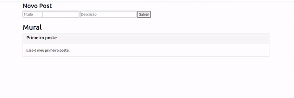

<h2>Seja bem vindo!</h2>
<h3>Sobre o projeto:</h3>

  Aplicação web para adicionar avisos em um mural.

<h3>Tecnologias utilizadas:</h3>
<ul>
  <li>
    Expressjs 
  </li>
  <li>
    Nodejs 
  </li>
  <li>
    Javascript 
  </li>
  <li>
    Boostrap
  </li>
  <li>
    HTML5
  </li>
</ul>
<h3>Link da aplicação</h3>
<a href="https://gamegenius.netlify.app/">Clique aqui!</a>
